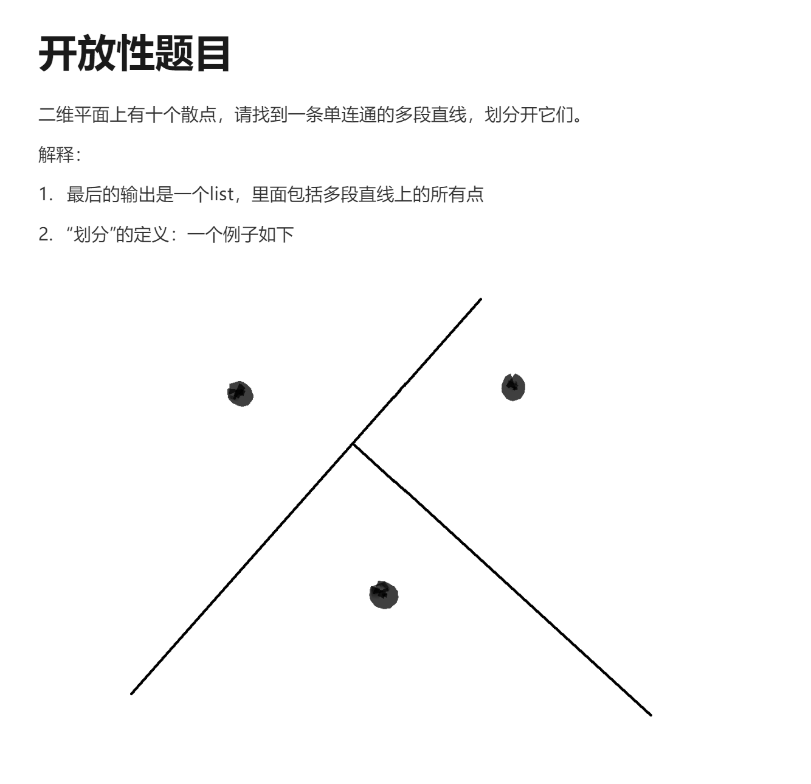
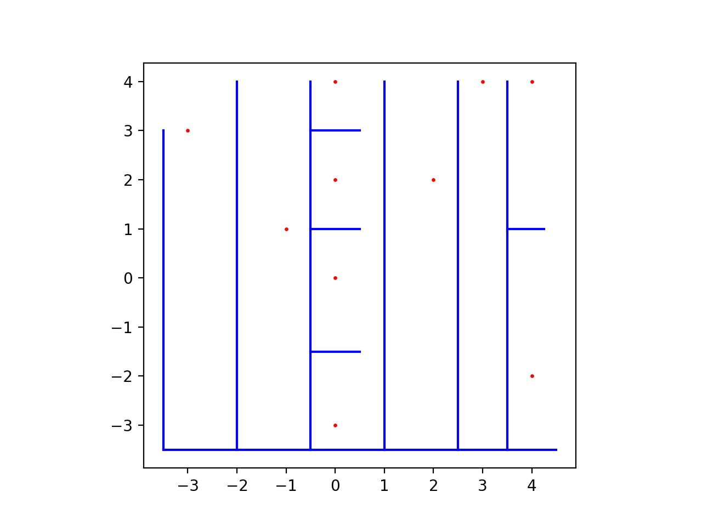
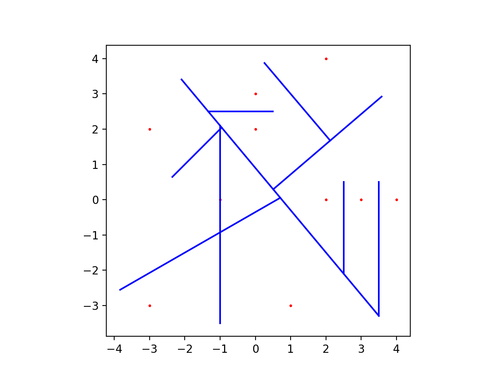
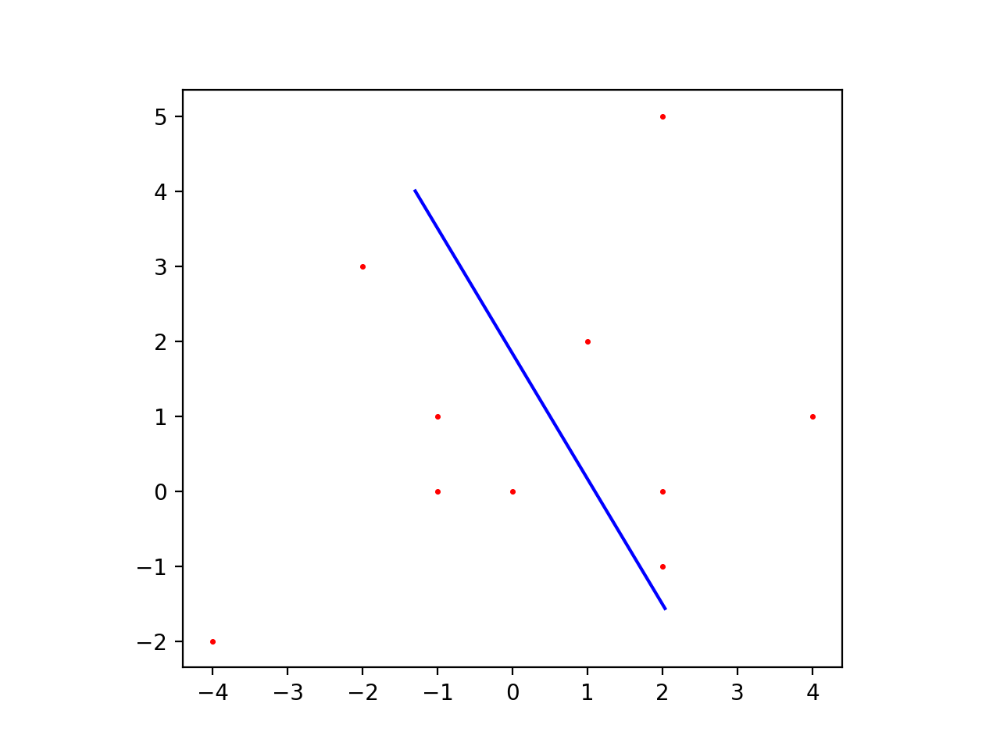
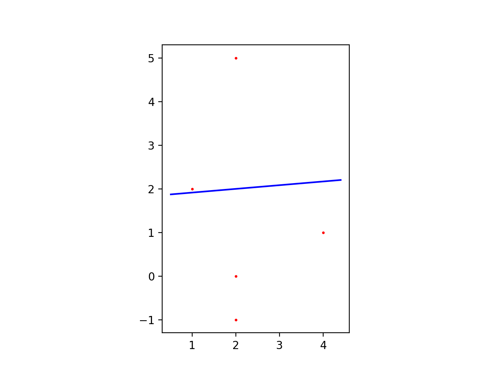

# 1. Run
Under Python3
## 1.1 Dependencies
`numpy`
`matplotlib`
`sklearn`
## 1.2 Demo
**solution1** `python test.py --method hard`
**solution2** `python test.py --method tree`

# 2. Description
## 2.0 Assumption
这里需要假设不存在坐标重叠的任意两散点，因为这样就不存在“划分”。
## 2.1 Solution1 - Hard

最简单的情况是，每个散点的x和y坐标都不相同，所以只需要在x或y坐标上“划”N-1条平行线，就可以把所有点划分开，并且加上一个垂直于这些平行线的线把所有线连通。

当存在x或y坐标有相同的情况时，首先还是根据x或y轴把散点分开成若干个区间，同个区间上点数多于1代表该区间点的y/x坐标相等，这时只需要在y/x方向上再划分区间即可。
## 2.2 Solution2 - Tree

该方法启发于**决策树**，当使用一个N分类决策树时，可以得到所有能够把散点划分的决策边界，但是因为决策树的决策边界方向由散点**坐标系**决定，也就是划分线都是平行于x或y轴，结果会跟`Hard`方法相似。这里使用的方法的决策边界方向是根据PCA得出的投影线的垂线定义的。

### 步骤
该方法递归地把散点划分成两个子集，第一个划分如下：

右方的5个散点继续被划分如下：

通过递归方式所有的点都被划分，最后把所有的划分线连接成连通就能获得结果。